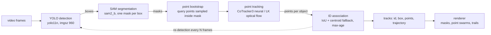

# Architecture

Detection, segmentation and point tracking of boats on water video. Water is a
hostile setting for every stage: glare and wave crests look like objects,
points drift onto moving water texture, targets are small and distant, and the
camera itself moves.

## Pipeline

## Modules

| module | responsibility |
|---|---|
| `marine_tracking/detect.py` | YOLO wrapper; lazy load; plain-numpy `Detection` out |
| `marine_tracking/segment.py` | SAM wrapper; falls back to the filled box on a failed mask |
| `marine_tracking/track.py` | LK point tracking, median-motion gate, IoU/centroid association, expiry — pure functions, unit-tested |
| `marine_tracking/pipeline.py` | per-frame glue for the LK backend; re-detection cadence with point-starvation override |
| `marine_tracking/neural_pipeline.py` | segment-based glue for CoTracker3; identity carried per query point |
| `marine_tracking/visualize.py` | masks, points, ids, trails; box-free mode |
| `scripts/run_video.py` | CLI, LK backend |
| `scripts/run_video_neural.py` | CLI, neural backend |
| `scripts/make_demo.py` | staged showcase video with the follow-zoom virtual camera |
| `scripts/benchmark.py` | the RESULTS.md measurement matrix |
| `scripts/download_sample.py` | CC BY-SA sample clip downloader (attribution in header) |

## Design decisions, and why

**Re-detection cadence.** YOLO + SAM every frame is the accuracy ceiling and
the FPS floor. Detection runs every N frames; between detections, objects
coast on their tracked points (LK: box shifted by median point motion;
neural: box re-derived from the points every frame). A track that starves
below a minimum point count forces an early re-detect.

**Masks gate the points.** A detection box on water is mostly water. Points
are seeded only inside the SAM mask, so they start on the object, not on the
wake beside it.

**Median-motion gate (LK backend).** A point that latched onto a wave crest
moves with the water, not the boat. Any point whose displacement disagrees
with the object's median displacement beyond a tolerance is dropped.

**Identity lives on the points, not the boxes (neural backend).** Each
CoTracker3 query point belongs to exactly one track id. The box is derived
from the points (8/92 percentile, so one stray point cannot balloon it), not
the other way round.

**Point carry-over across re-inits.** The neural tracker's queries are fixed
at init, so the pipeline re-initialises it at every re-detection boundary. A
track the detector MISSES at that boundary keeps its surviving points as
queries — identity outlives a detection gap instead of a new id being minted.
This was the single largest reducer of id churn.

**Association is pure and tested.** Greedy best-IoU first, then a
centroid-distance pass for leftovers (rescues re-detections whose box drifted
past IoU overlap), then a max-age expiry. All numpy, no models — the unit
tests run in milliseconds.

**Fail visible, degrade gracefully.** A failed SAM mask falls back to the
filled box rather than dropping the object; an occluded track coasts and
expires on a counter rather than vanishing the frame a detection blinks.

## Known limitations (honest list)

- Small distant boats flicker at the detector's confidence floor; each
  reappearance beyond max-age mints a new id. Mitigated by carry-over and
  cadence, not solved.
- No global camera-motion compensation yet; trajectories are image-space, not
  world-stable.
- The neural backend's memory grows with segment length (whole segment on
  GPU); 48 frames at 720p is comfortable on 16 GB.
- Overlapping boats can merge into one detection at crossings; association
  keeps ids through brief merges but a long merge swaps ids.
