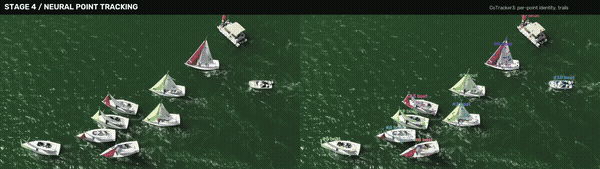
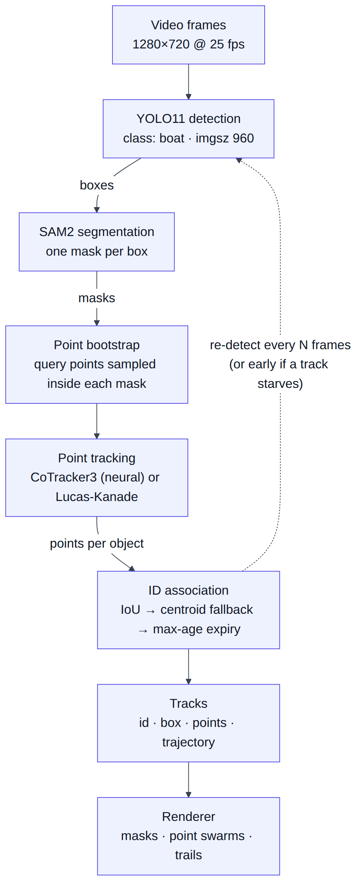
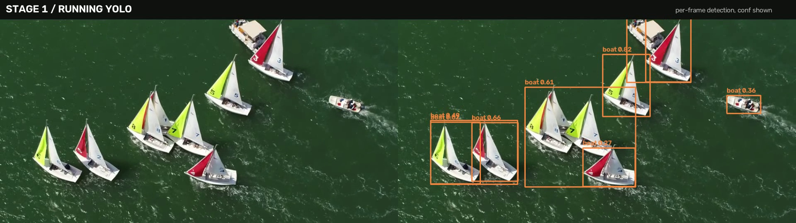
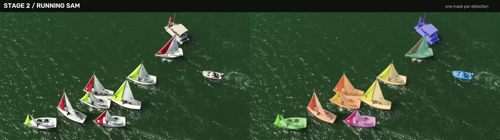
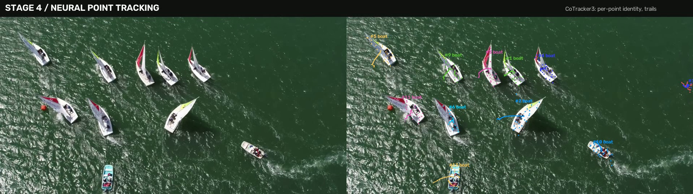

# Marine Vision Tracking

This project detects, segments and tracks boats in open-water video. It combines YOLO11 detection, SAM2 masks and CoTracker3 neural point tracking, and keeps a stable identity for each vessel while running at **~40 FPS**.

<p align="center">
  
</p>

<p align="center"><sub>Left: raw footage. Right: tracked output. <a href="media/demo.mp4">Full staged demo (29 s)</a>. Footage credit is under <a href="#credits-and-licenses">Credits</a>.</sub></p>

## Why water is hard

Every stage of a vision pipeline struggles on water:

- **Glare and wave crests** look like objects.
- **Tracked points drift** onto moving water texture.
- **Targets are often small and far away**, close to the detector's confidence floor.
- **The camera itself moves.**

This project is about keeping one stable identity per vessel under those conditions without running the expensive models on every frame.

## Pipeline

<p align="center">
  
</p>

1. **Detect.** YOLO11 finds boats in the frame.
2. **Segment.** SAM2 cuts a mask for each detected box. A box on water is mostly water, so the mask separates the hull and sails from the wake around them.
3. **Seed points inside the mask.** Points start on the boat itself, never on the water beside it.
4. **Track the points.** Two backends are available: CoTracker3 (neural, temporal window) or Lucas-Kanade optical flow with a median-motion gate that drops points riding the waves.
5. **Associate IDs.** Greedy IoU matching runs first, then a centroid-distance fallback, then a max-age expiry rule. This logic is pure numpy and unit-tested.
6. **Re-detect every N frames.** If a track runs short of points, re-detection happens early. Surviving points carry over across tracker re-inits, so a vessel the detector briefly misses keeps its ID.

Design reasoning for every stage is in [ARCHITECTURE.md](ARCHITECTURE.md).

## Results

Measured with `scripts/benchmark.py` over the same 500 frames (20 s at 1280×720) on a 16 GB NVIDIA GPU. There were about 12–13 real vessels in the scene. Fewer IDs is better.

| Configuration | Re-detect every N frames | FPS | Distinct IDs |
|---|---:|---:|---:|
| Detection only | — | 79.0 | — |
| Detect + SAM + Lucas-Kanade | 1 | 3.6 | 32 |
| Detect + SAM + Lucas-Kanade | 5 | 14.0 | 16 |
| Detect + SAM + Lucas-Kanade | 10 | 20.5 | 15 |
| Detect + SAM + CoTracker3 | 24 | 36.0 | 15 |
| **Detect + SAM + CoTracker3** | **48** | **39.9** | **14** |

**Takeaways:**
- **The neural backend wins on both speed and stability.** The heavy models run once every 48 frames instead of every 5–10, and CoTracker3's temporal window holds points through glare flicker that resets Lucas-Kanade.
- **Detecting every frame is the worst setting on both axes.** Re-associating noisy per-frame detections churns IDs faster than coasting on tracked points does.
- **14 IDs for about 13 vessels** means roughly one ID re-mint in 20 s, on a small boat that stayed below the confidence floor too long.

<table>
  <tr>
    <td width="33%"></td>
    <td width="33%"></td>
    <td width="33%"></td>
  </tr>
  <tr>
    <td align="center"><sub>1 · YOLO detection</sub></td>
    <td align="center"><sub>2 · SAM2 masks</sub></td>
    <td align="center"><sub>3 · Point tracking, IDs and trails</sub></td>
  </tr>
</table>

## Quick start

```bash
git clone https://github.com/DbugDiver/marine-vision-tracking.git
cd marine-vision-tracking
python -m venv .venv && source .venv/bin/activate      # Windows: .venv\Scripts\activate
pip install -r requirements.txt                        # pinned; CUDA 12.8 torch build
python scripts/download_sample.py                      # CC BY-SA sample clip (needs ffmpeg)
python scripts/run_video_neural.py --input data/samples/sample_open.mp4 \
       --output outputs/tracked.mp4 --side-by-side
```

Other entry points:
- `scripts/run_video.py`: the Lucas-Kanade backend.
- `scripts/benchmark.py`: reproduces the results table above.
- `scripts/make_demo.py`: renders the staged demo video, including the follow-zoom virtual camera.

CoTracker3 isn't a pip package. It loads through `torch.hub` (`facebookresearch/co-tracker`) on first use.

## Testing

```bash
pytest tests/ -q      # 15 tests, synthetic data, no models or video, runs in under a second
```

The tests cover IoU, greedy and centroid-fallback association, track expiry, and the median-motion gate. That's the logic that decides who matches whom and which points get thrown out.

## Project structure

```
marine_tracking/
  detect.py           YOLO wrapper → plain-numpy detections
  segment.py          SAM2 wrapper; falls back to the filled box if a mask fails
  track.py            LK tracking, median-motion gate, association, expiry (pure, tested)
  pipeline.py         per-frame glue for the LK backend, re-detection cadence
  neural_pipeline.py  CoTracker3 backend; identity carried per query point
  visualize.py        masks, point swarms, IDs, trails
scripts/              run_video, run_video_neural, benchmark, make_demo, download_sample
tests/                unit tests
docs/pipeline.png     pipeline diagram
```

## Limitations and next steps

- **Small distant boats** flicker at the detector's confidence floor. Lowering the threshold admits wave crests, so the real fix is fine-tuning on marine data, not threshold tuning.
- **No camera-motion compensation yet.** Trajectories are in image space, so a panning camera writes its own motion into every trail. Next step: background-feature homography.
- **Long overlaps at crossings** can swap IDs. Association currently only resolves short merges.

## Credits and licenses

- **Footage:** "Team sailing match-racing start at NHYC" by **Don Ramey Logan**, via [Wikimedia Commons](https://commons.wikimedia.org/wiki/File:Team_sailing_match-racing_start_at_NHYC_by_Don_Ramey_Logan.webm), licensed [CC BY-SA 4.0](https://creativecommons.org/licenses/by-sa/4.0/). The demo video, GIF and stills in `media/` are derived from it and are shared under the same license. The clip isn't stored in the repo; `scripts/download_sample.py` fetches it.
- **Models:**
  - [Ultralytics YOLO11 and SAM2 wrappers](https://github.com/ultralytics/ultralytics) (AGPL-3.0).
  - [SAM 2](https://github.com/facebookresearch/sam2) (Apache-2.0).
  - [CoTracker3](https://github.com/facebookresearch/co-tracker) (CC BY-NC 4.0, non-commercial use).
- **Code:** this repository is released under [AGPL-3.0](LICENSE), to stay compatible with Ultralytics.
